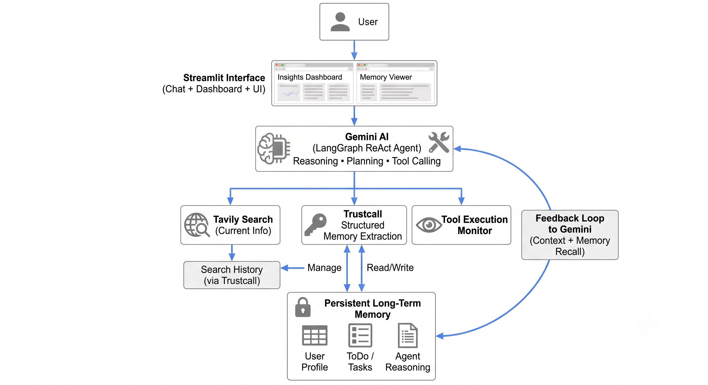

# 🧠 AI Task Manager Agent
**Autonomous Personal Productivity Agent with Long-Term Memory, Web Search & Transparent Reasoning to autonomously manage tasks, reason through decisions, retrieve current information, and continuously personalize itself.**


---
## 🚀 Overview

AI Task Manager Agent is an **enterprise-inspired Agentic AI system** that combines **Gemini**, **LangGraph**, **Trustcall**, **Tavily Search**, and **persistent long-term memory** to help users manage tasks through natural conversations.

**Unlike traditional chatbots, this agent can:**  
- 🧠 Long‑term user memory that persists across sessions
- 📋 Structured task management with updates, deadlines, and progress tracking
- 🌐 Real‑time web search for current information
- 💡 Transparent reasoning that explains how decisions are made
- 🔄 Continuous learning through schema‑driven memory updates
- 🤝 Human‑in‑the‑loop control for safe and predictable agent behavior  

The project demonstrates modern **Agent Engineering** principles including **ReAct reasoning**, **tool orchestration**, **persistent memory**, **schema-driven extraction**, and **explainable AI**.

### ✨ Features at a Glance
- Natural-language task creation & updates
- Persistent long-term memory for user profiles, tasks, reasoning, and search history
- Real-time web search powered by Tavily
- Transparent AI reasoning viewer for full observability
- Interactive HTML task dashboard with status, priority, and organization
- Search history with timestamps, summaries, and citations
- Adaptive user learning (preferences, interests, goals)

---
#### Engineering Motivation: 
Agentic AI is rapidly evolving, but most examples lack persistent memory, reasoning visibility, and real-world usability. This project demonstrates how to combine Gemini, LangGraph, Trustcall, and Tavily to build a practical, explainable, autonomous productivity agent.

---
## 🚀 Live Demo

Experience the deployed application here: [**🌐 Streamlit Cloud**](https://your-streamlit-app.streamlit.app)  
- No installation required.

---
# 🎬 Demo

---
# 🏗️ System Architecture


---
# 🧠 Memory Architecture


---
## ⭐ Key Capabilities

<table>
  <tr>
    <td width="50%" valign="top">

### 🤖 Autonomous Task Management
Automatically classifies tasks and maintains a dynamic HTML task dashboard
* **Natural Language Task Creation:** Create tasks effortlessly using plain English
* **Task Updates & Progress:** Modify tasks, track ongoing status, and archive completed work
* **Smart Deadlines & Solutions:** Automatically manage deadlines and receive AI-suggested solutions
* **Project Organization:** Structure and organize complex projects intelligently

### 🧠 Persistent Long-Term Memory
The agent continuously learns and maintains structured long-term memory across sessions:
* **👤 User Profile:** Learns personal preferences, interests, relationships, goals, habits, and work styles
* **📋 Task Memory:** Stores detailed tasks, deadlines, execution instructions, status, and solutions
* **🧠 Agent Learning & Reasoning:** Logs explainable summaries (Input Analysis, Context Understanding, Risk Assessment, Confidence, memory updates etc.)
* **🌐 Search History:** Retains queries, timestamps, AI summaries, and direct source citations

    </td>
    <td width="50%" valign="top">

### 🌐 Real-Time Web Search
Current real-world information is automatically retrieved via **Tavily Search** whenever required:
* **Live Topics:** Weather, sports, local restaurants, breaking news, travel, tech updates, and deep research
* **Automatic Memory Integration:** All web search findings are summarized and stored in long-term memory for future reference
* **Task Integration:** Search results are integrated as projected solutions or user solutions while keeping a **Human-in-the-Loop** for approval and verification 

### 🔍 Explainable AI & LLM Observability
Every agent response includes a transparent internal reasoning workflow so you can audit the decision process:
* 📥 **Input Analysis** & 🧠 **Context Understanding**
* 📚 **Learning** &       💡 **Decision Process**
* 💾 **Memory Impact** &  🚀 **Recommended Next Actions**
* ⚠️ **Risk Assessment**& 🎯 **Confidence Score**

*This full transparency makes the agent auditable, predictable, and easier to trust.*

  </td>
  </tr>
</table>

---
## ScreenShots

| Login | Chat |
|-------|------|
|  |  |

| Dashboard | Agent Reasoning |
|------------|----------------|
|  |  |

| Memory Store | Search History |
|--------------|----------------|
|  |  |

## ⚙️ Technology Stack

| Layer | Technology |
|--------|------------|
| LLM | Gemini 3.1 Flash Lite |
| Agent Framework | LangGraph |
| Web Framework | Streamlit |
| Memory Extraction | Trustcall |
| Web Search | Tavily |
| Validation | Pydantic |
| Memory Store | LangGraph Store |
| Language | Python |

---

# 📁 Project Structure

```
📦 AI-Task-Manager-Agent

│
├── app.py
│
├── agent/
│   ├── graph.py
│   ├── nodes.py
│   ├── router.py
│   ├── memory_store.py
│   ├── trustcall.py
│   ├── schema.py
│   ├── llm.py
│   ├── HTML_todo_dashboard.py
│   └── HTML_patch_viewer.py
│
├── requirements.txt
│
├── .env.example
│
└── README.md
```

---

# 🚀 Getting Started

Clone the repository

```bash
git clone https://github.com/yourusername/AI-Task-Manager-Agent.git
```

Install dependencies

```bash
pip install -r requirements.txt
```

Create a `.env` file

```text
GOOGLE_API_KEY=YOUR_KEY

TAVILY_API_KEY=YOUR_KEY
```

Run the application

```bash
streamlit run app.py
```

---

# 💡 Example Conversation

**User**

> Remind me to call the dance school on Saturday.

↓

Agent

✅ Creates a task

↓

Stores it in long-term memory

↓

Suggests a reminder

↓

Explains why it created the task

---

**User**

> What's the best Indian restaurant near Irving, TX?

↓

Agent

Uses Tavily Search

↓

Finds current recommendations

↓

Stores search history

↓

Updates lunch task

↓

Explains reasoning

↓

Returns answer

---

# 🎯 Engineering Highlights : Enterprise AI Agent
- Gemini ReAct Agent Architecture
- Persistent Long-Term Memory
- Explainable AI
- Tool Calling
- Structured Memory Extraction
- Persistent User Personalization
- Tavily Search Integration
- Trustcall Schema Validation/Memory Updates
- Transparent Agent Reasoning
- LangGraph State Machine
- Human-in-the-Loop Design
- Modular Node Architecture
- Search History
- Streamlit UI

---

# 🛣️ Future Roadmap

- Google Calendar Integration
- Gmail Integration
- MCP Server Support
- Google ADK Migration
- Vertex AI Deployment
- Docker Support
- Cloud Run Deployment
- Voice Assistant
- Multi-Agent Collaboration
- Mobile Interface

---

# 🙏 Acknowledgements

Built using

- Google Gemini
- LangGraph
- Streamlit
- Trustcall
- Tavily Search
- Streamlit
- Pydantic
- python

---
🔐 Security & Privacy Notes
- User data is stored locally in the LangGraph memory store.
- No data is sent to third-party services except Gemini and Tavily.
- API keys must be stored in .env and never committed.
This project is for educational purposes and not intended for production security. Any PII data usage should be avoided.

## ⭐ If you found this project interesting, consider giving it a star!

### 👩‍💻 Author: Divya Shetty
#### Licence : MIT
#### Citation: 
This project is an enhancement of the LangGraph project from LangChain Academy, extending it with Gemini‑powered reasoning, HTML card todo list,tavily search API, trustcall persistance and AI observability.
